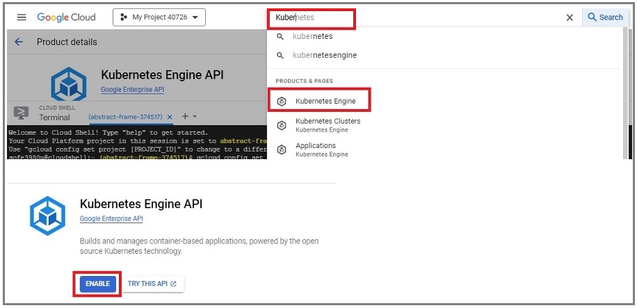
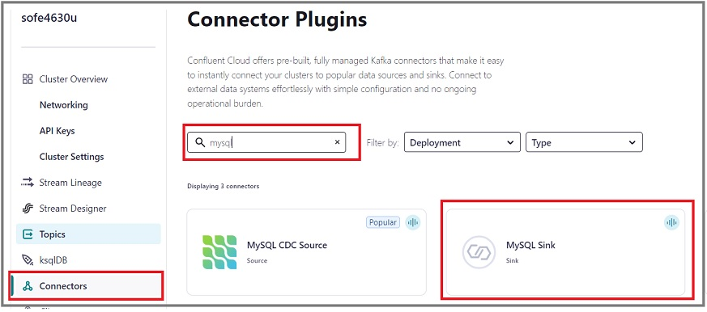
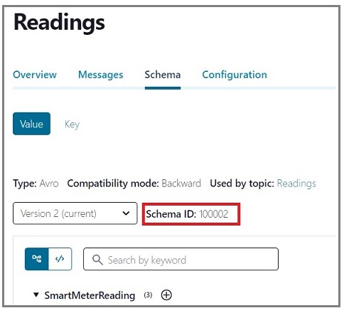
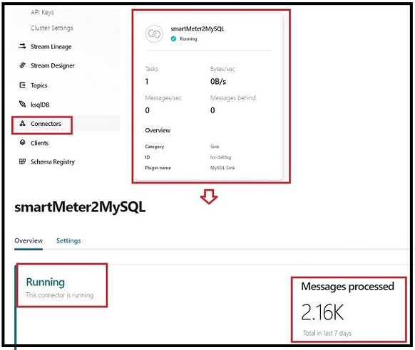
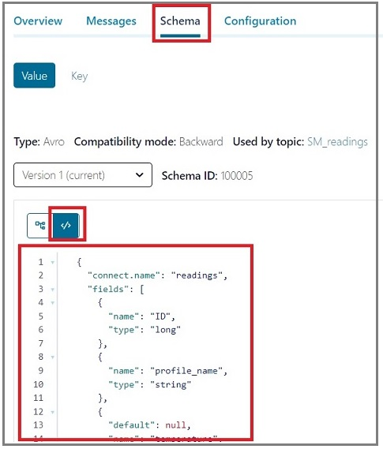

# Milestone 2:  Data Storage and Pub/Sub connects

## Objective:
* Get familiar with Docker images and containers.
* Deploy tabular and key-value data storage using Google Kubernetes Engine (GKE).
* Get familiar with key-value data storage.
* Create and configure connectors from Google Pub/Sub to MySQL server.
* Create and configure connectors from Google Pub/Sub to Redis server.

## Repository:
[https://github.com/GeorgeDaoud3/SOFE4630U-MS2](https://github.com/GeorgeDaoud3/SOFE4630U-MS2)

## Introduction:
1. The video shows a case study of containerization in DevOps. The concept of Docker containerization is used extensively in the cloud world. Watch the video to familiarize yourself with [Docker](https://youtu.be/rOTqprHv1YE) terminologies. 
2. We will use Kubernetes (**K8s**) to manage Docker images and applications. The following video covers [Kubernetes and its components](https://youtu.be/cC46cg5FFAM).
3. Kubernetes will be used to deploy both The MySQL and Redis servers. Watch the first **7:45 minutes** in the following video to get familiar with [Redis commands](https://youtu.be/jgpVdJB2sKQ).
4. Kafka has an existing tool to automatically store into data storage the data published into a topic. This tool is called Kafka Connect. Watch the following video for more information about [Kafka Connect](https://www.youtube.com/watch?v=Lmus2AFX-oc).
5. We will create a similar tool within GCP in this lab. However, we will focus on the sink connectors, It's possible to create a source connector as well.

## Setting Google Kubernetes Engine
To set up Google Kubernetes Engine (**GKE**), open the console of the project you have created within the Google Cloud Platform (GCP) during the first milestone.
1. Set the default compute zone to **northamerica-northeast1-b**
   
   ```cmd
   gcloud config set compute/zone northamerica-northeast1-b  
   ```
    
2. Enable GKE by searching for **Kubernetes Engine**. Select **Kubernetes Engine API**. Then, click **Enable**.
   
   
   
3. Wait until the API is enabled. Then, create a three-node cluster on GKE called **sofe4630u**. A Node is a worker machine in which docker images and applications can be deployed.
   
   ```cmd
   gcloud container clusters create sofe4630u --num-nodes=3 
   ```
      
   **Note**: if the authorization windows pop up, click Authorize
   
   **Note**: if you get an error that there are no available resources to create the nodes, you may need to change the default compute zone (e.g., to **us-central1-a**) or reduce the number of nodes.

## Deploy MySQL using GKE:
1. We will use a YAML file to deploy a pre-created MySQL image over the GKE cluster. A YAML file contains the configuration used to set the deployment. The deployment's role is to orchestrate docker applications.

   1. Clone the GitHub repository
       
      ```cmd 
      cd ~
      git clone https://github.com/GeorgeDaoud3/SOFE4630U-MS2.git
      ```
        
   2. Run the following command to deploy the MySQL server
      
      ```cmd 
      cd ~/SOFE4630U-MS2/mySQL
      kubectl create -f mysql-deploy.yaml
      ```
        
      The command will deploy the configuration stored in the [mysql-deploy.yaml](/mySQL/mysql-deploy.yaml) into GKE. It would pull the **mysql/mysql-server** Docker image and deploy and enable the **3306** port number to allow access from the outside world. The file **mysql-deploy.yaml** is used to configure the deployment. It's shown in the following figure and can be interpreted as:
      
         * **Indentation** means nested elements
      
         * **Hyphen** means an element within a list
      
         * **First two lines**: indicate the YAML file type and its version.
      
         * **Line 4**: provides a name for the deployment.  Kubernetes will use this name to access the deployment.
      
         * **Line 6**: indicates that only a single pod will be used.
      
         * **Line 9**: provides the name of the application that the pod will access.
      
         * **Line 16**: provides the ID of the Docker image to be deployed.
      
         * **Lines 19-24**: define image-dependent environment variables that define the username/password (**usr/sofe4630u**), and a schema (**Readings**).
      
         * **Line 26**: defines the port number that the image will use.
      
                  
   
   3. The following command can check the status of the deployment
      
      ```cmd 
      kubectl get deployment 
      ```

   4. While the following command can access the status of pods
      
      ```cmd 
      kubectl get pods  
      ```

      check that the deployment is available and that the pod is running successfully (it may take some time until everything is settled down)
      
2. To give the deployment an IP address, a load Balancer service, mysql-service, should be created for that deployment. The load Balancer distributes the requests and workload between the replicas in the deployment (why this is not important in our case?) and associates an IP to access the deployed application.
   
   1. The load Balancer service configuration is included in the [mysql-service.yaml](/mySQL/mysql-service.yaml) file from the cloned repo.
      
      ```cmd 
      cd ~/SOFE4630U-MS2/mySQL
      kubectl create -f mysql-service.yaml
      ```
      
      The essential lines in the mysql-service.yaml file is:
      
         * **Line 8**: the port number that will be assigned to the external IP.
           
         * **Line 10**:  the name of the application that the service will target.
     
                  
   
   2. To check the status of the service, use this command
      
      ```cmd 
      kubectl get service 
      ```
   
            
   
      It may take some time until the external IP address is changed from pending to a valid IP address. You may need to repeat the previous command.
      
3. To access the MySQL using the IP address,

   1. Run the following commands From any device on which the MySQL client is installed ( or the GCP console). Before running the command, replace the <IP-address> with the external IP obtained in the previous step. The options **-u**, **-p**, and **-h** specify the deployed server's username, password, and host IP, respectively.
      
      ```cmd
      mysql -uusr -psofe4630u -h<IP-address>
      ```
   2. Try to run the following SQL statements to create a table, insert 3 records, and search the table.
      ```sql
      use Readings; 
      create table meterType( ID int primary key, type varchar(50), cost float); 
      insert into meterType values(1,'boston',100.5); 
      insert into meterType values(2,'denver',120); 
      insert into meterType values(3,'losang',155); 
      select * from meterType where cost>=110; 
      ```
   3. Exit the MySQL CLI, by running
      ```sql
      exit
      ```
   5. (**optional**) after creating a video for submission, you can delete the deployment by using the following command (**Don’t run it right now**)
       ```cmd
      kubectl delete -f mysql-deploy.yaml
      kubectl delete -f mysql-service.yaml
      ```  
## Deploy Redis using GKE:
1. Watch the first 7:45 minutes in the following video to get familiar with [redis commands](https://youtu.be/jgpVdJB2sKQ).  
2. Both the deployment and the load balancer service are included in the same file. To deploy both to GKE, run the following commands 
   ```cmd
   cd ~/SOFE4630U-MS3/Redis
   kubectl create -f redis.yaml
   ```
   Check that status of deployment, service, and pod. Note that the password is set within the yaml file to **sofe4630u**.
3. Get Redis external IP.
   ```cmd
   kubectl get services
   ```
         
4. To access the Redis datastore,
   1. You can install the Redis client on your machine as shown in the previous video. However, let’s install it over the GCP console.
      ```cmd
      sudo apt-get install redis-tools
      ```
      **Note**: this installation is not persistent and you need to repeat it each time the session is ended.
   2. Now, let’s log in to the server using the command after replacing the **\<Redis-IP\>** with the IP obtained in step 3 and **sofe4630u** for the password.  
      ```cmd
      redis-cli -h <Redis-IP> -a sofe4630u
      ```
   3. Now, try to run the following commands. **Note**, there are 16 different databases to select within Redis. The first command selects the first database (0). What are the functions of other commands? 
      ``` cmd
      select 0
      set var 100
      get var
      keys *
      del var
      keys *
      ```
   4. Finally to exit the command line interface, type
      ```cmd
      exit
      ```
5. To access, Redis using python code,
   1. Install its library on your local machine (or GCP console) 
      ``` cmd
      pip install redis
      ```
   2. In the cloned Github at path [/Redis/code/](/Redis/code/), there are two python files and a jpg image. 
      * **SendImage.py**, will read the image **ontarioTech.jpg** and store it in Redis associated with a key **"OntarioTech"** at database 0.
      * **ReceiveImage.py**, will read the value associated with the key **"OntarioTech"** from the Redis server and will save it into **received.jpg** image.
      * You have to set the Redis Server IP in the second line in both **SendImage.py** and **ReceiveImage.py**.
      * Run **SendImage.py**, then check the keys in the Redis server. Finally, Run **ReceiveImage.py** and check that the **received.jpg** image is created.

## Configure Kafka Connector with MySQL sink
The sink connector is a Kafka service that automatically consumes from a topic(s) and stores the consumed messages in a data storage, as shown in the following figure.

   

1. Watch the following video about [Kafka connect](https://youtu.be/YXgXw25E5RU).
2. Log in to the **Confluent Kafka account** you created in the first milestone. Make sure you are still in the trial period.
3. As described in the first milestone, create a topic and name it **Readings**. This topic will be accessed by the connector for data.
4. Add a Schema to the topic to be used by the connector to create a table in MySQL database. 
   **Note**: you can have the schema during the topic creation. but we will asume that the topic has created without schema).
   1. Navigate to the **Readings** topic. Then, choose the **Schema** tap. Make sure that **Value** is selected. Finally, click **Set a schema**.

            

   2. Choose **Avro** as the serialization format, delete the default avro schema, and copy the [following script](connectors/mysql/schema.txt) as the new schema, then click **create**.

      

   3. The schema is describing the following fields
      
      | Name         | Lunch order   | Nullable |
      | ------------ | ------------- | -------- |
      | ID           | long          | False    |
      | profile_name | string        | False    |   
      | temperature  | double        | True     |
      | humidity     | double        | True     |
      | modified     | Timestamp     | False    |      
      
6. Create a MySQL sink connector.
   1. Within the cluster, click **Add Connector**, choose **connectors**, search for **MySQL**, and finally select **MySQL sink**

      
      
   2. Fill in the configuration (keep the default values if not mentioned) as in 
      1. **Topic selection**:
         * **Topic name**: **Readings**
      2. **Kafka credentials**: use the existing **API key** and **API secret** you have created in the first Milestone (or create a new one).
      3. **Authentication**: Enter the information of the MySQL server we already have deployed on GKE
         * **Connection host**: The MySQL IP you obtained before
         * **Connection port**: **3306**
         * **Connection user**: **usr**
         * **Connection password**: **sofe4630u**
         * **Database name**: **Readings**
         * **SSL mode**: **prefer**
      4. **Configuration**: (click **show advanced configurations**)
         * **Input Kafka record value format**: **AVRO**
         * **Insert mode**: **UPSERT**
         * **Auto create table**: **true**
         * **Auto add columns**: **true**
         * **PK mode**: **record_value**
         * **PK fields**: **ID**
         * **Input Kafka record key format**: **string**
      5. **Sizing**: 
         * **Tasks**:1
      6. Review and launch: 
         * **Connector name**: **smartMeter2MySQL**
   
      The previous settings configure the connector to continuously consume from the **Readings** topic and deserialize the message using the **Avro** schema into a record. The record will be stored in the **MySQL server** deployed before on **GKE**. A table with the same name as the topic (**Readings**) will be created in the database (**Readings**), and the data will be inserted using the field named **ID** from the consumed messages (values) as the primary key.
   4. It will take a few minutes until the connector is running.
7. Send data to the topic from your local machine (or GCP console)
   1. Install Avro library.
      ```cmd
      pip install avro
      ```
   2. Copy the schema ID
	
      
	
   3. Three files are needed found at the path [/connectors/mysql/](/connectors/mysql/) in the GitHub repository
      * **cred.json**: you have to edit it and specify the **Bootstrap server**, the **API key**, and the **API secret** of the Kafka cluster as you did in the first milestone.
      * **schema.txt**: contains the schema of the topic and will be accessed by the Avro library to serialize each record before sending it to the topic. Don't change its content.
      * **smartMeter.py**: will use **cred.json** to access the Kafka cluster and **schema.txt** to serialize records and send them as messages to be sent to the Reading topics.
      * You have to update the **schemaID** at line 12. 
      * A new function called **encode** is defined that will encode each record in Avro format.
      * Each record has a new field called **ID** that will be used as a primary key by the connector.
         
   4. Update **cred.json** and **smartMeter.py** as described. Note the three files should be saved in the same folder.
   5. run **smartMeter.py**
8. Check that the connector is successfully processed the messages. 
	
   
	
9. Check MySQL database
   1. log into Mysql server
      ```cmd
      mysql -uusr -psofe4630u -h<IP-address>
      ```
   2. get the list of tables in the database
      ```sql
      select TABLE_NAME from INFORMATION_SCHEMA.TABLES where TABLE_SCHEMA='Readings';
      ```
      as the connector will create a table with the same name as the topic, a table with the name **Readings** should be returned by the previous statement as well as **meterType** table created before.
   3. query the values in the table
      ```sql
      Use Readings;
      select * from Readings limit 10;
      ```
      The output should look like
	
      
	
   4. Exit from the MySQL interface
      ```sql
      exit
      ```

## Configure Kafka Connector with MySQL source
The source connector is a Kafka service that automatically read values from a data storage and produce them into a topic, as shown in the following figure.

   

1. Log in to the **Confluent Kafka account** you created in the first milestone. Make sure you are still in the trial period.
2. Create a **MySQL source** connector.
   1. Within the cluster, choose **connectors**, click **Add Connector**, search for **MySQL**, and finally select **MySQL source**
   2. Fill in the configuration (keep the default values if not mentioned) as in 
      1. **Topic selection**:
         * **Topic prefix**: **SM_**
      2. **Kafka credentials**: use the existing **API key** and **API secret** you have created in the first Milestone  (or create a new one).
      3. **Authentication**: Enter the information of the MySQL server we already have deployed on GKE
         * **Connection host**: The MySQL IP you obtained before
         * **Connection port**: **3306**
         * **Connection user**: **usr**
         * **Connection password**: **sofe4630u**
         * **Database name**: **Readings**
         * **SSL mode**: **prefer**
      4. **Configuration**: (click **show advanced configurations**)
         * **Table names**: **Readings**
         * **Select output record value format**: **AVRO**
         * **Timestamp column name**: **modified**
      5. **Sizing**: 
         * **Tasks**:1
      6. Review and launch: 
         * **Connector name**: **MySQL2Kafka**
	
      The previous settings configure the connector to continuously query new records from a table (or set of tables), namely **Readings** from a particular MySQL database (**Readings**), serialize each record as a message in Avro format, and produce the message into a Kafka topic. The Kafka topic name will be the same as the table(s) name but with a prefix (**SM_**). The connector will automatically create the Avro schema. **Note**: we are using the **Readings** table created in the previous section to make things easier, but it's not necessary.
   3. It will take a few minutes until the connector is running.
3. Check that a topic with the name **SM_Readings** is created and there are messages already received in the topic. 
4. To consume the messages, we will use three files; **avroConsumer.py**, **cred.json**, **schema2.txt** in the path [connectors/mysql/](connectors/mysql/) at the GitHub repository.
   1. you should copy the schema of the generated topic (**SM_Readings**), and paste it into **schema2.txt**.
	
      
	
   2. use the same **cred.json**, you have updated in the previous section.
   3. Make sure that the three files are in the same folder. Then, run **avroConsumer.py** to consume the messages from the **SM_Readings** topic.
	
   Note that **avroConsumer.py** has a function called **decode** that deserializes Avro objects. 
	
## Redis Sink Connector
It's like the MySQL sink connector but for Redis. The key and value of the Kafka message will be used as the key and value for Redis. 
1. Log in to the **Confluent Kafka account** you created in the first milestone. Make sure you are still in the trial period.
2. Create a topic and name it **ToRedis**
3. Create a Redis sink connector.
   1. Within the cluster, choose **connectors**, click **Add Connector**, search for **Redis**, and finally select **Redis Sink**
   2. Click Next
   3. Fill in the configuration (keep the default values if not mentioned) as in 
      1. **Install Connector**:
         * **Select or create new topics** : **ToRedis**
      2. **Kafka credentials**: use the existing **API key** and **API secret** you have created in the first Milestone  (or create a new one).
      3. **Authentication**: Enter the information of the Redis server we already have deployed on GKE
         * **Redis hostname**: The Redis IP you obtained before
         * **Redis port number**: **6379**
         * **Redis database index**: **1**
         * **Redis server password**: **sofe4630u**
         * **SSL mode**: **disabled**
      4. **Configuration**: (click **show advanced configurations**)
         * **Input Kafka record value format**: **BYTES**
         * **Input Kafka record key format**: **STRING**
      5. **Sizing**: 
         * **Tasks**:1
      6. Review and launch: 
         * **Connector name**: **Kafka2Redis**
            The previous settings configure the connector to continuously consume messages from the topic named **ToRedis**. Each key and value of each message will be stored as a key-value pair in the Redis at database 1.
4. To send an image (as an example) to the Kafka topic, we will use files from the GitHub repository at the path [/connectors/Redis/](/connectors/Redis/)
   * **cred.json**: has to be updated as described before
   * **ontarioTech.jpg**: the image to be sent to the Kafka topic
   * **produceImage.py**: produces the image to a kafka topic named **ToRedis** with a key **fromKafka**
   * make sure that the three files at the same folder. then, run **produceImage.py**.
5. To check that the connector works and that the key/value message is parsed and sent to the Redis server, check the status of the connector at Confluent Kafka.
6. To check that the connector, ReceiveImage.py will read the bytes associated with the key from the Redis server and save as another JPG file (**recieved.jpg**).
   * First, change the IP at line 4 with the Redis IP.
   * Run **ReceiveImage.py**
   * check that **recieved.jpg** is created and its content is a copy of the original sent image.
The following figure summerizes the integration of the previou scripts with the connector and Redis.

## Discussion: 
* How do Kafka connectors maintain availability?
* MySQL connector supports three serialize/deserialize methods; JSON, AVRO, and PROTOBUF. What are the advantages and disadvantages of each.
* There are two options for **Insert mode** (**UPSERT** or **INSERT**) can be configured for MySQL sink connector. Compare both of them and provide a use case for each of them.
* Confluent Cloud Kafka supports connectors while Google Pub/Sub doesn't support them. What are the advantages and disadvantages of adding connectors to any pub/sub service?

## Design: 
Although Google Pub/Sub doesn't support connectors, it can be implemented using Data flow or any other processing service. Update the Dataflow pipeline you implemented in the second milestone to include a parallel branch that saves the preprocessed records into a MySQL server deployed on GKE.

You may find [this package](http://mohaseeb.com/beam-nuggets/beam_nuggets.html) helpful

# Deliverables
1. A report that includes the Discussion part and description of the updated pipeline.
2. The code you implemented in the Design part.
2. An audible video of about 5 minutes showing the connectors described. Your video should highlight the check steps.
3. Another audible video of about 3 minutes shows the output of the design part.
