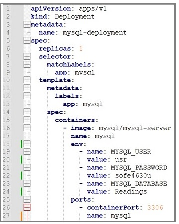
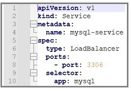
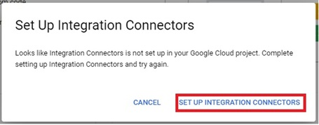
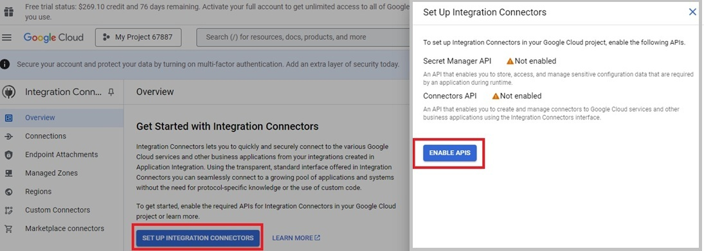
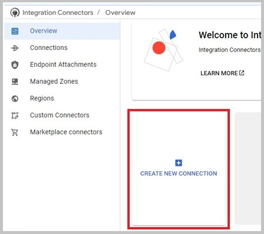
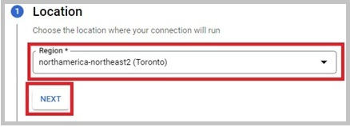
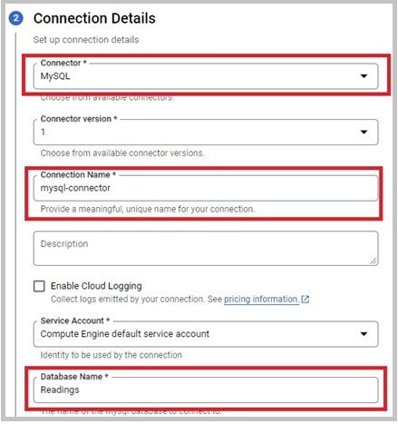
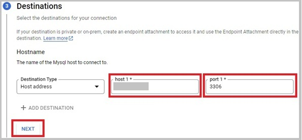

# Milestone 2:  Data Storage and Pub/Sub connects

## Objective:
* Get familiar with Docker images and containers.
* Deploy tabular and key-value data storage using Google Kubernetes Engine (GKE).
* Get familiar with key-value data storage.
* Create and configure connectors from Google Pub/Sub to MySQL server.
* Create and configure connectors from Google Pub/Sub to Redis server.

## Repository:
[https://github.com/GeorgeDaoud3/SOFE4630U-MS2](https://github.com/GeorgeDaoud3/SOFE4630U-MS2)

## Introduction:
1. The video shows a case study of containerization in DevOps. The concept of Docker containerization is used extensively in the cloud world. Watch the video to familiarize yourself with [Docker](https://youtu.be/rOTqprHv1YE) terminologies. 
2. We will use Kubernetes (**K8s**) to manage Docker images and applications. The following video covers [Kubernetes and its components](https://youtu.be/cC46cg5FFAM).
3. Kubernetes will be used to deploy both The MySQL and Redis servers. Watch the first **7:45 minutes** in the following video to get familiar with [Redis commands](https://youtu.be/jgpVdJB2sKQ).
4. Kafka has an existing tool to automatically store into data storage the data published into a topic. This tool is called Kafka Connect. Watch the following video for more information about [Kafka Connect](https://www.youtube.com/watch?v=Lmus2AFX-oc).
5. We will create a similar tool within GCP in this lab. However, we will focus on the sink connectors, It's possible to create a source connector as well.

## Setting Google Kubernetes Engine
To set up Google Kubernetes Engine (**GKE**), open the console of the project you have created within the Google Cloud Platform (GCP) during the first milestone.
1. Set the default compute zone to **northamerica-northeast1-b**
   
   ```cmd
   gcloud config set compute/zone northamerica-northeast1-b  
   ```
    
2. Enable GKE by searching for **Kubernetes Engine**. Select **Kubernetes Engine API**. Then, click **Enable**.
   
   
   
3. Wait until the API is enabled. Then, create a three-node cluster on GKE called **sofe4630u**. A Node is a worker machine in which docker images and applications can be deployed.
   
   ```cmd
   gcloud container clusters create sofe4630u --num-nodes=3 
   ```
      
   **Note**: if the authorization windows pop up, click Authorize
   
   **Note**: if you get an error that there are no available resources to create the nodes, you may need to change the default compute zone (e.g., to **us-central1-a**) or reduce the number of nodes.

## Deploy MySQL using GKE:
1. We will use a YAML file to deploy a pre-created MySQL image over the GKE cluster. A YAML file contains the configuration used to set the deployment. The deployment's role is to orchestrate docker applications.

   1. Clone the GitHub repository
       
      ```cmd 
      cd ~
      git clone https://github.com/GeorgeDaoud3/SOFE4630U-MS2.git
      ```
        
   2. Run the following command to deploy the MySQL server
      
      ```cmd 
      cd ~/SOFE4630U-MS2/mySQL
      kubectl create -f mysql-deploy.yaml
      ```
        
      The command will deploy the configuration stored in the [mysql-deploy.yaml](/mySQL/mysql-deploy.yaml) into GKE. It would pull the **mysql/mysql-server** Docker image and deploy and enable the **3306** port number to allow access from the outside world. The file **mysql-deploy.yaml** is used to configure the deployment. It's shown in the following figure and can be interpreted as:
      
         * **Indentation** means nested elements
      
         * **Hyphen** means an element within a list
      
         * **First two lines**: indicate the YAML file type and its version.
      
         * **Line 4**: provides a name for the deployment.  Kubernetes will use this name to access the deployment.
      
         * **Line 6**: indicates that only a single pod will be used.
      
         * **Line 9**: provides the name of the application that the pod will access.
      
         * **Line 16**: provides the ID of the Docker image to be deployed.
      
         * **Lines 19-24**: define image-dependent environment variables that define the username/password (**usr/sofe4630u**), and a schema (**Readings**).
      
         * **Line 26**: defines the port number that the image will use.
      
                  
   
   3. The following command can check the status of the deployment
      
      ```cmd 
      kubectl get deployment 
      ```

   4. While the following command can access the status of pods
      
      ```cmd 
      kubectl get pods  
      ```

      check that the deployment is available and that the pod is running successfully (it may take some time until everything is settled down)
      
2. To give the deployment an IP address, a load Balancer service, mysql-service, should be created for that deployment. The load Balancer distributes the requests and workload between the replicas in the deployment (why this is not important in our case?) and associates an IP to access the deployed application.
   
   1. The load Balancer service configuration is included in the [mysql-service.yaml](/mySQL/mysql-service.yaml) file from the cloned repo.
      
      ```cmd 
      cd ~/SOFE4630U-MS2/mySQL
      kubectl create -f mysql-service.yaml
      ```
      
      The essential lines in the mysql-service.yaml file is:
      
         * **Line 8**: the port number assigned to the external IP.
           
         * **Line 10**:  the name of the application that the service will target.
     
                  
   
   2. To check the status of the service, use this command
      
      ```cmd 
      kubectl get service 
      ```
   
            
   
      It may take some time until the external IP address is changed from pending to a valid IP address. You may need to repeat the previous command.
      
3. To access the MySQL using the IP address,

   1. Run the following commands from any device where the MySQL client is installed (or the GCP console). Before running the command, replace the <IP-address> with the external IP obtained from the previous step. The options **-u**, **-p**, and **-h** specify the deployed server's username, password, and host IP, respectively.
      
      ```cmd
      mysql -uusr -psofe4630u -h<IP-address>
      ```
   2. Try to run the following SQL statements to create a table, create three records, and search the table.
      ```sql
      use Readings; 
      create table meterType( ID int primary key, type varchar(50), cost float); 
      insert into meterType values(1,'boston',100.5); 
      insert into meterType values(2,'denver',120); 
      insert into meterType values(3,'losang',155); 
      select * from meterType where cost>=110; 
      ```
   3. Exit the MySQL CLI, by running
      ```sql
      exit
      ```
   5. (**optional**) After creating a video for submission, you can delete the deployment by using the following command (**Don’t run it right now**)
       ```cmd
      kubectl delete -f mysql-deploy.yaml
      kubectl delete -f mysql-service.yaml
      ```  
## Deploy Redis using GKE:

1. The deployment and the load balancer service are in the same file. To deploy both to GKE, run the following commands 

   ```cmd
   cd ~/SOFE4630U-MS2/Redis
   kubectl create -f redis.yaml
   ```

   Check the status of deployment, service, and pod. Note that the password is set within the YAML file to **sofe4630u**.
   
2. Get Redis external IP.
   
   ```cmd
   kubectl get services
   ```
   
   
   
3. To access the Redis datastore,
   1. To access the Redis server, install the Redis client on your machine. Fortunately, it's installed in the GCP and can be accessed from the console.
      
   2. Log in the to Redis server from the GCP console using the command after replacing the **\<Redis-IP\>** with the IP obtained in step 2 and **sofe4630u** for the password.
      
      ```cmd
      redis-cli -h <Redis-IP> -a sofe4630u
      ```
      
   3 Try to run the following commands. **Note**: there are 16 different databases to select within Redis. The first command selects the first database (0). What are the functions executed by other commands? 
      ``` cmd
      select 0
      set var 100
      get var
      keys *
      del var
      keys *
      ```
   4. Finally, to exit the command line interface, type

      ```cmd
      exit
      ```

4. To access Redis using Python code,
   
   1. Install its library on your local machine (or GCP console) 

      ``` cmd
      pip install redis
      ```
      
   2. In the cloned Github at path [/Redis/code/](/Redis/code/), there are two Python files and a JPG image.
      
      * **SendImage.py**, will read the image **ontarioTech.jpg** and store it in Redis associated with a key **"OntarioTech"** at database 0.
        
      * **ReceiveImage.py**, will read the value associated with the key **"OntarioTech"** from the Redis server and save it into **received.jpg** image.
        
      * Set the Redis Server IP in the second line in **SendImage.py** and **ReceiveImage.py**.
        
      * Run **SendImage.py**, then check the keys in the Redis server. Finally, run **ReceiveImage.py** and check that the **received.jpg** image has been created.

## Create a Pub/Sub sink connector to MySQL

   ### 1. Create an Integration Connectors to The MySQL Server

      Integration Connectors provide a transparent, standard interface to connect to various data sources from your integrations. As an integration developer, you can quickly connect to a growing pool of applications and systems without the need for protocol-specific knowledge or the use of custom code.
      
      1. Search for **Connectors** and choose **Connections / Integration Connectors**.

         
         
      2. For the first time, click **SET UP INTEGRATION CONNECTORS**.
         
         
         
      3. Click The **SET UP INTEGRATION CONNECTORS** button and click **ENABLE APIS". Wait until the API is been enabled. Then, click **Done**.

         

      4. Click **CREATE NEW CONNECTION**
         
         
         1. Choose The location to be **northamerica-northeast2 (Toronto)**.
            
         2. Click **NEXT**.
         3. In the **connection Details**, search for **MySQL** for the **connector** type. Set the **Connection Name** to **mysql-connector** and the **Database Name** to **Readings**. Leave everything else by its default value.
            
         4. Click **NEXT**.
         5. For the Dstinations, set The MySQL IP address obtained before in the **host 1** text box and **3306** in the **port 1** text box.
            
